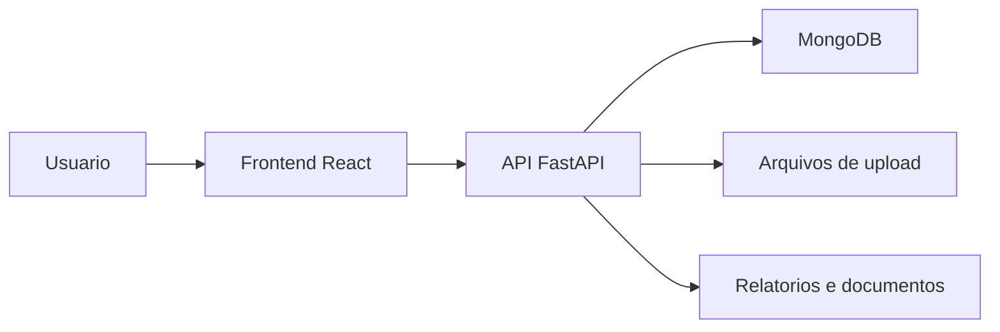

# GestaoEPI Multi Empresas V2

Sistema web para gestao de Equipamentos de Protecao Individual (EPIs) com suporte a operacao multiempresa, controle de colaboradores, fornecedores, kits, entregas, historico, relatorios e recursos de rastreabilidade.

## Visao Geral

Este repositorio representa uma versao historica do GestaoEPI voltada a empresas que precisam registrar, acompanhar e consultar entregas de EPIs por colaborador e por empresa. O projeto combina uma API em Python/FastAPI, interface web em React e persistencia em MongoDB.

## Problema Resolvido

O sistema foi criado para reduzir controles manuais de entrega de EPIs, centralizar dados de colaboradores e empresas, organizar kits por contexto operacional e gerar registros consultaveis para acompanhamento interno.

## Principais Funcionalidades

### Funcionalidades Disponiveis

- Autenticacao de usuarios e perfis de acesso.
- Cadastro e gestao de empresas.
- Cadastro e gestao de colaboradores.
- Cadastro de EPIs, fornecedores e estoque.
- Organizacao de kits de EPIs.
- Registro de entregas de EPI.
- Historico de entregas.
- Relatorios operacionais.
- Painel master para administracao multiempresa.
- Recursos relacionados a reconhecimento facial e QR code identificados nas dependencias e telas.

### Funcionalidades Em Desenvolvimento

- Ajustes e evolucoes de multiempresa aparecem em arquivos de teste e documentacao do projeto.
- Melhorias de alertas, kits e exibicao de detalhes de EPIs aparecem em telas e testes do repositorio.

### Funcionalidades Planejadas

- Nao ha roadmap publico consolidado no repositorio. Qualquer evolucao deve ser confirmada antes de ser apresentada como entregue.

## Como Funciona

```text
Usuario acessa o sistema
-> realiza login
-> seleciona empresa, modulo ou rotina operacional
-> cadastra ou consulta colaboradores, EPIs, fornecedores e kits
-> registra entregas e movimentacoes
-> o backend processa as solicitacoes pela API
-> os dados sao armazenados no MongoDB
-> relatorios e historicos ficam disponiveis para consulta
```

## Tecnologias Utilizadas

- Python
- FastAPI
- MongoDB
- Motor/PyMongo
- React
- Tailwind CSS
- face-api.js
- html5-qrcode
- ReportLab
- OpenPyXL

## Arquitetura



## Estrutura Do Projeto

- `backend/`: API, autenticacao, modelos, banco de dados, rotas e rotinas de seed.
- `frontend/`: interface web, paginas, componentes e integracao com a API.
- `backend/tests/`: testes automatizados relacionados a funcionalidades do backend.
- `tests/`: estrutura auxiliar de testes.
- `test_reports/` e `memory/`: artefatos de acompanhamento existentes nesta versao historica.

## Status

Versao antiga / historica. A versao principal mais recente parece estar relacionada aos repositorios `GestorEPI-multiempresas-v5-9` e `GestaoEPI-V5.1.0-NOVO-01`.

## Minha Participacao

Projeto desenvolvido e organizado por Michele Santana, com foco em sistemas internos, automacao operacional e solucoes para gestao de EPIs.

## Autor

Desenvolvido por Michele Santana — Kalion Tecnologia
